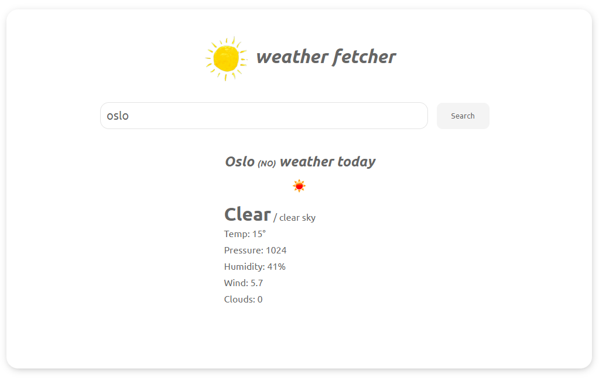
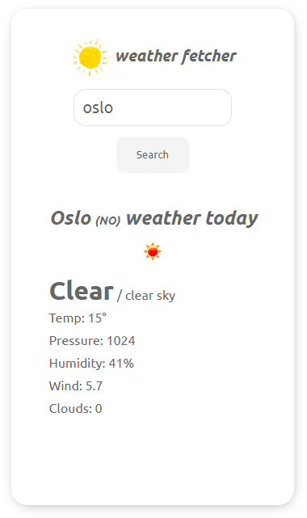

# ⛅️ weather-fetcher ☔️
Simple web app for dispalying the weather based on a city name. The application based `React` and made usage of [`openweathermap.org`](https://www.openweathermap.org/) api

## Usage
### Method 1 (recommended)
Download the artifact from the [`bin`](https://github.com/shimizacken/weather-fetcher/blob/master/bin/weather-fetcher.zip) folder, excract it, and open the `index.html` file in the browser. It does not requires a web server

### Method 2  
Clone the repo
```bash
git clone https://github.com/shimizacken/weather-fetcher.git
```
then run the following command in the root folder:
```bash
npm install
```
and then run:
```bash
npm start
```



